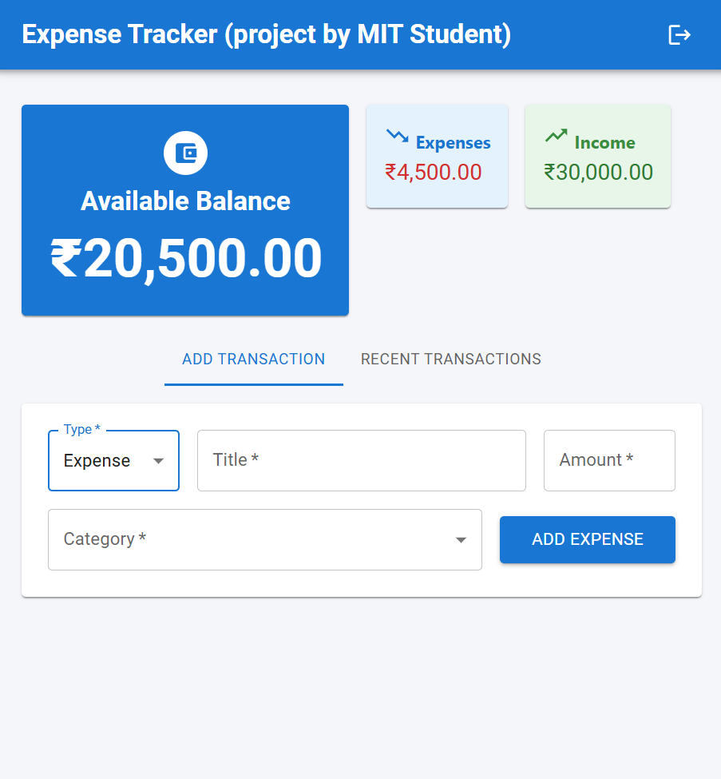
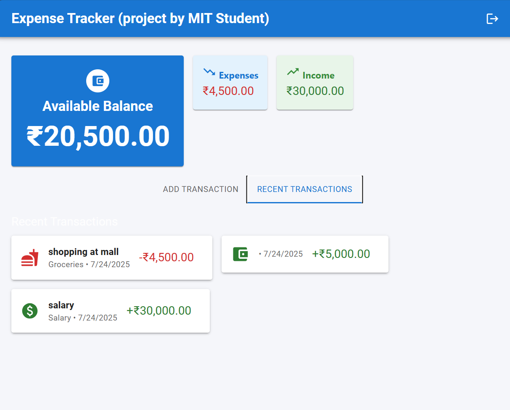

# expense-tracker
-A simple project using react,SpringBoot and PostgreSQL

## ✨ Features
-Simple UI
  Total Income, Expenses, and Investments
-User Authentication (Register/Login/Logout with JWT)
-Add Transactions
  Add Income, Expense, or Investment
  Category dropdown auto-changes for Income/Expense
-Recent Transactions List
  Shows all transactions 
-Snackbar Notifications for actions (add, error, etc.)
-Logout Button in AppBar
-Easy to extend (add UPI, PDF export, etc.)

Note:
-please add username and password in properties
-im using postgreSQL you can use other 
